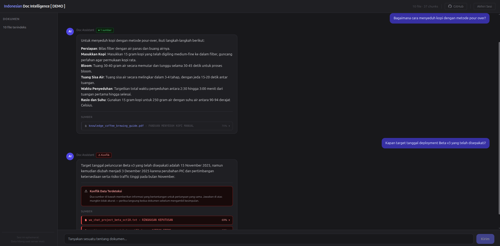

# Indonesian Document Intelligence

Sistem tanya-jawab berbasis RAG untuk dokumen kerja berbahasa Indonesia. Upload file, ajukan pertanyaan - sistem menjawab berdasarkan isi dokumen dengan sumber yang bisa diverifikasi, trust score, dan deteksi konflik antar dokumen.



> **Catatan:** Proyek ini dibuat sebagai **catatan pembelajaran** membangun RAG pipeline untuk dokumen informal berbahasa Indonesia, **bukan untuk kebutuhan produksi**. Keputusan teknis, eksperimen, dan keterbatasan sistem didokumentasikan secara eksplisit di folder `documentations/`.

---

## Problem Statement

Dokumen kerja berbahasa Indonesia - catatan, laporan, korespondensi - sering ditulis dalam gaya informal, penuh singkatan, dan tersebar di banyak file. Mencari informasi spesifik dari kumpulan dokumen tersebut membutuhkan membuka dan membaca satu per satu secara manual.

Proyek ini membangun pipeline yang memungkinkan pertanyaan dalam bahasa natural dijawab dari kumpulan dokumen yang diupload, dengan dua tambahan yang tidak ada di sistem RAG standar: **deteksi konflik** (jika dua dokumen memberikan fakta yang bertentangan untuk pertanyaan yang sama, sistem melaporkannya alih-alih menyembunyikannya) dan **trust score** (jawaban diberi label `found`, `not_found`, atau `conflict` berdasarkan bukti retrieval dan konsistensi sumber).

---

## System Design

```
Upload Dokumen
    |
    v
Document Parsing            [LlamaIndex SimpleDirectoryReader · .txt / .pdf / .docx]
    |
    v
Chunking                    [SentenceSplitter · 512 token · 100 overlap]
    |
    v
Contextual Enrichment       [gpt-4o-mini · entitas, seksi, ringkasan konteks per chunk]
    |
    v
Dual Indexing               [Pinecone dense + BM25 in-memory sparse]
    |
    v
[Sesi aktif - dokumen tersedia untuk query]
```

```
Query Masuk
    |
    v
Normalisasi Query           [gpt-4o-mini · typo, singkatan, bahasa informal]
    |
    v
Hybrid Retrieval            [EnsembleRetriever · BM25 + Pinecone · bobot 50/50 · top-20]
    |
    v
Reranking                   [Jina Reranker v2 Multilingual · top-10 · threshold 0.20]
    |
    v
Context Assembly            [chunk_id marker untuk citation tracking]
    |
    v
Generasi Jawaban            [gpt-4o-mini · structured output · answer + citations + conflict flag]
    |
    v
Trust Score + Conflict Detection
    |
    v
Jawaban + Sumber + Skor Relevansi -> User
```

Detail setiap tahap dan keputusan desain: [documentations/PIPELINE.md](documentations/PIPELINE.md)

---

## Features

- **Hybrid retrieval** - BM25 (lexical) + Pinecone (semantic), ensemble dengan bobot setara
- **Conflict detection** - jika dua dokumen memberikan fakta yang bertentangan untuk pertanyaan yang sama, sistem melaporkannya secara eksplisit beserta kedua sumber
- **Trust score** - `found` / `not_found` / `conflict` berbasis isi jawaban, jumlah sumber dikutip, dan flag konflik
- **Evidence trail** - setiap jawaban disertai referensi ke dokumen sumber dan skor relevansi
- **Query normalization** - typo, singkatan, dan bahasa informal dinormalisasi sebelum retrieval
- **Session isolation** - setiap sesi mendapat Pinecone namespace sendiri, dokumen antar sesi tidak bercampur
- **Format yang didukung:** `.txt`, `.pdf` (digital, bukan hasil scan), `.docx`

---

## Limitations

- **Dirancang untuk Bahasa Indonesia:** Seluruh pipeline - prompt enrichment, normalisasi query, generasi jawaban, dan model reranker - dikonfigurasi dan diuji untuk dokumen dan pertanyaan berbahasa Indonesia. Dokumen berbahasa lain belum diuji dan hasilnya tidak dapat dijamin.
- **Sesi ephemeral:** Dokumen tidak tersimpan setelah server mati. Upload ulang diperlukan setiap sesi baru.
- **PDF digital only:** Dokumen PDF hasil scan (image-based) tidak bisa dibaca. Tidak ada OCR.
- **Conflict detection terbatas:** Konflik hanya terdeteksi jika LLM mengenali kontradiksi yang jelas dalam konteks yang sama. Konflik tersirat atau konflik antar bagian dokumen yang berbeda bisa terlewat.
- **Enrichment berbayar:** Setiap chunk yang diupload memanggil LLM untuk enrichment, sehingga upload banyak file berbiaya API lebih tinggi.
- **Tidak ada conversation history:** Setiap pertanyaan diproses independen. Sistem tidak menyimpan konteks pertanyaan sebelumnya, sehingga follow-up atau pertanyaan lanjutan yang merujuk jawaban sebelumnya tidak didukung.
- **Rate limiting in-memory:** Rate limit reset saat server restart, tidak persisten antar instance.
- **Evaluasi RAGAS menggunakan data sintetis:** Query evaluasi dibuat dari model yang sama dengan model jawaban - ada risiko skor inflasi. Lihat catatan bias di [EVALUATION.md](documentations/EVALUATION.md).

Detail tiap limitation: [documentations/ARCHITECTURE.md](documentations/ARCHITECTURE.md#limitations)

---

## Tech Stack

Stack ini sengaja *lebih dari yang dibutuhkan* untuk skala proyek ini - tujuannya eksplorasi tools dan metodologi yang dipakai di environment nyata, bukan karena semua komponen justified secara teknis di skala ini.

| Komponen | Tool |
|---|---|
| Web framework | [FastAPI](https://fastapi.tiangolo.com/) |
| Data validation | [Pydantic v2](https://docs.pydantic.dev/) |
| Document parsing | [LlamaIndex](https://www.llamaindex.ai/) SimpleDirectoryReader + SentenceSplitter |
| LLM + Embedding | [OpenAI](https://platform.openai.com/) `gpt-4o-mini` + `text-embedding-3-small` |
| Vector database | [Pinecone](https://www.pinecone.io/) (ephemeral namespace per sesi) |
| Sparse retrieval | [BM25](https://github.com/dorianbrown/rank_bm25) in-memory |
| Reranker | [Jina Reranker v2 Multilingual](https://jina.ai/reranker/) |
| LLM orchestration | [LangChain](https://python.langchain.com/) |
| Rate limiting | [slowapi](https://github.com/laurentS/slowapi) |
| Observability | [LangSmith](https://smith.langchain.com/) (opsional, dinonaktifkan saat ingestion) |
| UI | [Jinja2](https://jinja.palletsprojects.com/) + [HTMX](https://htmx.org/) + [Alpine.js](https://alpinejs.dev/) + [Tailwind CSS](https://tailwindcss.com/) |
| Deployment | [Docker](https://www.docker.com/) + [Docker Compose](https://docs.docker.com/compose/) |

**Yang sengaja tidak dipakai:**

| Tool | Alasan |
|---|---|
| LangGraph | State management eksplisit tidak dibutuhkan untuk pipeline linear ini |
| Persistent storage | Sesi ephemeral adalah keputusan desain - tidak ada kebutuhan menyimpan dokumen antar sesi |
| OCR (pytesseract, etc.) | Menambah dependency berat untuk use case yang bisa dihindari dengan instruksi format |
| Weaviate / Qdrant | Managed vector DB lain tidak memberikan keunggulan berarti untuk satu namespace per sesi |

---

## Quick Start

```bash
# 1. Clone repo
git clone https://github.com/qrizan/indonesian-document-intelligence
cd indonesian-document-intelligence

# 2. Siapkan environment variables
cp .env.example .env
# Isi: OPENAI_API_KEY, PINECONE_API_KEY, JINA_API_KEY
# Opsional: LANGCHAIN_API_KEY (untuk tracing di LangSmith)

# 3. Jalankan server
docker compose up --build

# 4. Buka http://localhost:8000
# Upload dokumen -> ajukan pertanyaan -> lihat jawaban + sumber + trust score
```

**Dokumen contoh untuk testing:** [Google Drive](https://drive.google.com/drive/folders/1Q3bTbvDpvymeCTHbmvQp8IBMQhoNhbk_?usp=sharing)

---

## Environment Variables

| Variable | Keterangan | Wajib |
|---|---|---|
| `OPENAI_API_KEY` | Untuk LLM (enrichment, normalisasi, generasi) dan embedding | Ya |
| `PINECONE_API_KEY` | Untuk vector store ephemeral per sesi | Ya |
| `JINA_API_KEY` | Untuk reranking | Ya |
| `LANGCHAIN_API_KEY` | LangSmith tracing | Tidak |
| `LANGCHAIN_TRACING_V2` | Aktifkan tracing (`"true"` / `"false"`, default `"false"`) | Tidak |
| `LANGCHAIN_PROJECT` | Nama project di LangSmith | Tidak |

---

## Project Structure

```
indonesian-document-intelligence/
├── app/
│   ├── main.py                    # FastAPI entrypoint, rate limiting, session routing
│   ├── config.py                  # Pydantic settings + pipeline config
│   ├── models.py                  # Pydantic schemas antar layer
│   ├── pipeline.py                # RAG pipeline: hybrid retrieval, reranking, generation
│   ├── ingestion.py               # Parsing, chunking, enrichment, indexing
│   ├── prompts.py                 # Semua LLM prompt
│   ├── stopwords.py               # Indonesian stopwords untuk keyword highlighting
│   └── templates/
│       ├── base.html              # Layout + header
│       ├── index.html             # Halaman upload
│       ├── session.html           # Wrapper saat refresh dengan sesi aktif
│       └── components/
│           ├── upload_success.html  # Chat interface
│           └── query_result.html    # Response bubble + sumber + trust score
├── scripts/
│   └── test_pipeline.py           # 10 skenario fungsional end-to-end
├── documentations/
│   ├── ARCHITECTURE.md
│   ├── PIPELINE.md
│   ├── DATA_CONTRACT.md
│   ├── EVALUATION.md
│   ├── DECISIONS.md
│   └── CHANGELOG.md
├── .env.example
├── Dockerfile
└── docker-compose.yml
```

---

## Notebooks (Google Colab)

Fase eksperimen sebelum implementasi aplikasi. Tidak di-maintain setelah v1.0.0 - pipeline saat ini hanya ada di `app/`.

| Notebook | Deskripsi |
|---|---|
| [00 - Environment Setup](https://drive.google.com/file/d/1car_CjiNF-F--a-u3qsLU5MnsD8I5bJf/view?usp=sharing) | Install dependencies, konfigurasi API keys, validasi koneksi ke OpenAI dan Pinecone |
| [01 - Data Preparation](https://drive.google.com/file/d/18bH8L7-S5paEEkYLuM8OXX5mnV6-1vHi/view?usp=sharing) | Membuat dokumen sintetis berbahasa Indonesia untuk eksperimen (catatan, email, chat export) |
| [02 - Document Ingestion and Chunking](https://drive.google.com/file/d/18bH8L7-S5paEEkYLuM8OXX5mnV6-1vHi/view?usp=sharing) | Parsing PDF/TXT/DOCX dengan LlamaIndex, chunking dengan SentenceSplitter, eksplorasi ukuran chunk |
| [03 - Document Router](https://drive.google.com/file/d/1-L_FtTEQrjLXBIBL7z9vZPV-IC0RGBu4/view?usp=sharing) | Eksperimen routing dokumen berdasarkan tipe sebelum diputuskan tidak dipakai di pipeline final |
| [04 - Contextual Enrichment and Indexing](https://drive.google.com/file/d/1ngBoEPo_gKaKAhBlzyHPaB7wtwUSYvBU/view?usp=sharing) | Eksperimen LLM enrichment per chunk (entitas, seksi, ringkasan konteks) dan indexing ke vector store |
| [05 - Retrieval Baseline and Query Normalization](https://drive.google.com/file/d/14zah-xuaIEYxnGIpKELVzPx190T5o4-J/view?usp=sharing) | Baseline retrieval dense-only, eksperimen normalisasi query informal/singkatan |
| [06 - Hybrid Retrieval and Reranking](https://drive.google.com/file/d/17BDTt68zTblO7o9pPtSD1iztsGNuOkJI/view?usp=sharing) | EnsembleRetriever BM25+Pinecone, eksperimen bobot dan threshold, reranking dengan Cohere (sebelum migrasi ke Jina di v1.0.0) |
| [07 - Full Pipeline Evaluation RAGAS](https://drive.google.com/file/d/1PXtkioegjIt94VSA7HlawgEIP6aGoCLm/view?usp=sharing) | Evaluasi end-to-end dengan RAGAS, 50 query sintetis, analisis Faithfulness/Answer Relevancy/Context Recall |
| [08 - Export and Deployment Prep](https://drive.google.com/file/d/1-cUmSxoExr19MQxhzqnNASHMnDybGR-j/view?usp=sharing) | Konversi pipeline notebook ke modul aplikasi, persiapan Dockerfile dan Docker Compose |

---

## Evaluation

| Fase | Metode | Hasil |
|---|---|---|
| Fase 1 (Notebook) | RAGAS, 50 query sintetis | Faithfulness 0.633 / Answer Relevancy 0.730 / Context Recall 0.600 |
| Fase 2 (Aplikasi) | Fungsional end-to-end, 10 skenario | 9/10 passed, 1 gagal karena retrieval limitation |

Angka Fase 1 menggunakan query sintetis yang dibuat oleh model yang sama dengan model jawaban - ada risiko skor inflasi akibat tumpang tindih vocabulary. Lihat catatan lengkap di [EVALUATION.md](documentations/EVALUATION.md).

---

## Documentation

| Dokumen | Isi |
|---|---|
| [ARCHITECTURE.md](documentations/ARCHITECTURE.md) | Tech stack, arsitektur sistem, session management, struktur modul, limitasi |
| [PIPELINE.md](documentations/PIPELINE.md) | Detail setiap tahap pipeline: ingestion, retrieval, reranking, generation, semua prompt |
| [DATA_CONTRACT.md](documentations/DATA_CONTRACT.md) | Schema API, format request/response, kontrak data internal |
| [EVALUATION.md](documentations/EVALUATION.md) | Metodologi evaluasi, hasil, catatan bias, dan limitasi yang diketahui |
| [DECISIONS.md](documentations/DECISIONS.md) | Log keputusan teknis dengan rationale dan trade-off |
| [CHANGELOG.md](CHANGELOG.md) | Riwayat perubahan per versi |

---

## Notes

**LLM bukan komponen pencari.** LLM digunakan di tiga titik: enrichment chunk saat ingestion, normalisasi query, dan generasi jawaban. Retrieval sepenuhnya dilakukan oleh BM25 dan Pinecone. Ini mencegah hallusinasi dan membuat jawaban bisa diverifikasi ke sumber dokumen.

**Enrichment chunk adalah kompromi biaya vs kualitas.** Setiap chunk diperkaya dengan entitas, seksi, dan ringkasan konteks saat ingestion - bukan saat query. Ini menambah biaya upload tapi tidak menambah latensi per query. Alternatif tanpa enrichment sudah diuji di notebook dan menghasilkan retrieval yang lebih buruk untuk dokumen informal.

**Conflict detection sengaja konservatif.** Sistem hanya menandai konflik jika LLM menemukan kontradiksi faktual yang jelas dari sumber yang dikutip, dan hanya jika minimal dua dokumen berbeda terlibat. False positive lebih berbahaya dari false negative di sini - lebih baik tidak melaporkan konflik daripada salah menandai jawaban yang konsisten sebagai konflik.

**Sesi ephemeral adalah keputusan desain, bukan keterbatasan teknis.** Menyimpan dokumen antar sesi membutuhkan autentikasi, manajemen storage, dan kebijakan retensi data - semua di luar scope proyek ini. Pinecone namespace dihapus saat server shutdown untuk menghindari akumulasi data stale.

**Notebook bukan cerminan pipeline saat ini.** Beberapa komponen berubah signifikan setelah fase eksperimen: reranker berganti dari Cohere ke Jina, parameter chunk dan retrieval disesuaikan, trust score dari formula numerik ke label kategoris, dan conflict detection serta citation mechanism diimplementasi langsung di aplikasi tanpa ada padanannya di notebook.

**Semua keputusan teknis didokumentasikan dengan rationale dan trade-off** di [DECISIONS.md](documentations/DECISIONS.md).
